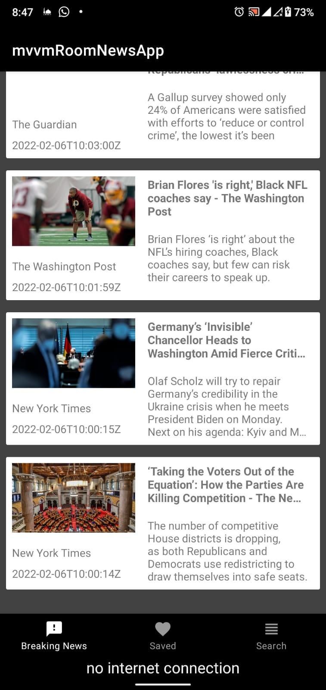
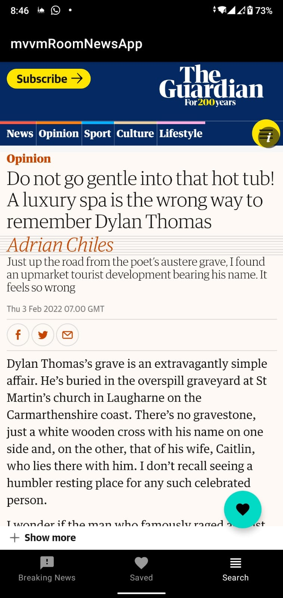
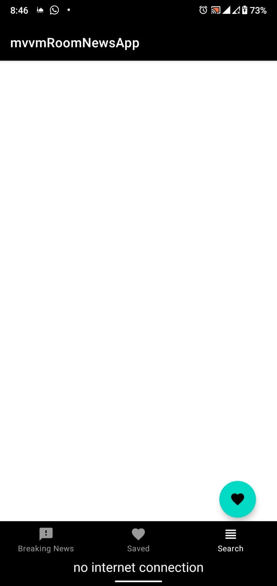
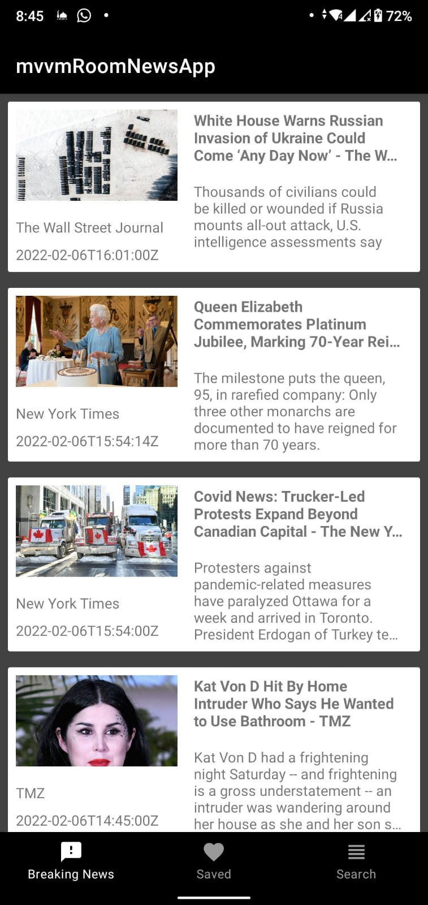
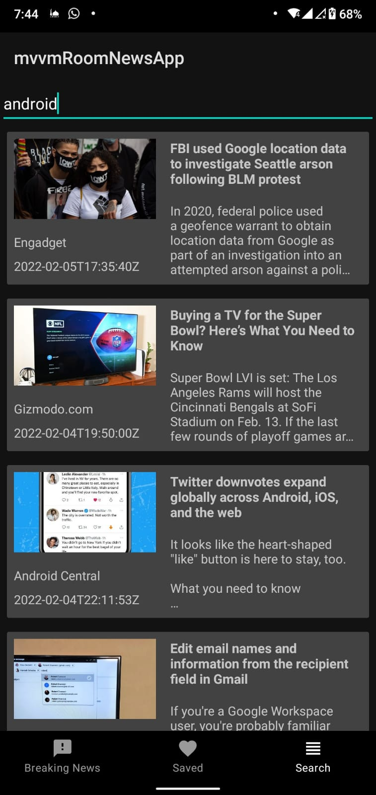
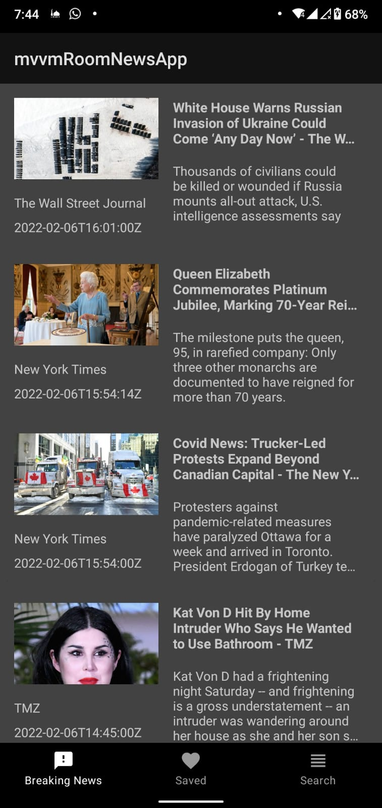

# mvvm_room_news_app
 News app | android kotlin 
 
      

## video preview
[app video on youtube]( https://www.youtube.com/watch?v=tdblS4EzRmg ) 

## dependencies
- navigation
- room
- mvvm
- coroutines
- retrofit
- work manager
- web view
